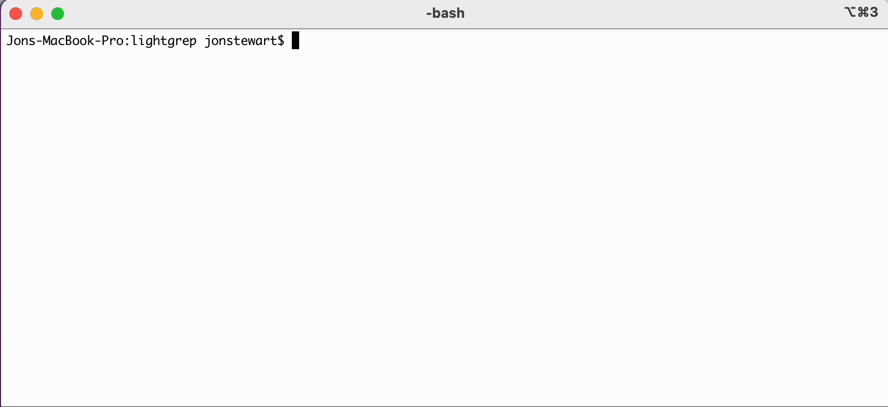
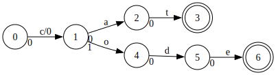

lightgrep
============

not the worst forensics regexp engine

About
-----
Lightgrep is a regular expression engine, designed specifically for digital forensics. Why another regexp engine?

Lightgrep:
 * searches for many patterns simultaneously
 * searches binary data as a stream, not as discrete lines of text
 * searches for patterns in many different encodings; give it dirty data, lightgrep don't care
 * never, ever, ever, never, never looks at a byte twice or backs up in your input

Lightgrep is an [automata-based engine](https://en.wikipedia.org/wiki/Finite-state_machine) and doesn't have all the regexp features you might be used to. However, it has proved very useful in digital investigations and is well-tested.

Lightgrep has both a command-line program for conducting searches against files and a C library, liblightgrep, for using in programs and scripts. The command-line program can search binary and text. The library has a C API and has bindings for both Python and Java. 

Lightgrep is copyright (c) 2010-2024, Stroz Friedberg, LLC. Lightgrep is available under version 3 of the GNU Public License. See [COPYING](COPYING) for details.

lightgrep command-line
----------------------
The lightgrep command-line program searches files and provides some helpful information concerning provided patterns.

### `lightgrep --help`

The `--help` flag will tell lightgrep to report on all its command-line switches:
```
lightgrep 1.5.0
Copyright (c) 2010-2024, Stroz Friedberg, LLC
Built Apr  8 2024
Usage: lightgrep [OPTION]... PATTERN_FILE [FILE]...
       lightgrep [OPTION]... [-p PATTERN | -k FILE]... [FILE]...

Command selection:
  -c [ --command ] CMD (=search)        command to perform [search|graph|prog|s
                                        amp|validate|analyze]
  --help                                display this help message
  --list-encodings                      list known encodings
  -V [ --version ]                      print version information and exit

Pattern selection and interpretation:
  -k [ --keywords ] FILE                path to keywords file
  -p [ --pattern ] PATTERN              a keyword on the command-line
  -e [ --encoding ] ENCODING (=ASCII)   encoding to use (e.g., ASCII, UTF-8)
  -i [ --ignore-case ]                  ignore case distinctions
  -F [ --fixed-strings ]                interpret patterns as fixed strings

Input and output:
  -o [ --output ] FILE (=-)             output file (stdout default)
  -a [ --arg-file ] FILE                read input paths from file
  -r [ --recursive ]                    traverse directories recursively
  --histogram-file FILE                 output file for histogram
  -H [ --with-filename ]                print the filename for each match
  -h [ --no-filename ]                  suppress the filename for each match
  -A [ --after-context ] NUM            print NUM lines of trailing context
  -B [ --before-context ] NUM           print NUM lines of leading context
  -C [ --context ] NUM                  print NUM lines of context
  --group-separator SEP (=--)           use SEP as the group separator
  --no-output                           do not output hits (good for profiling)
  --block-size BYTES (=8388608)         block size to use for buffering, in
                                        bytes
  --mmap                                memory-map input file(s)

Miscellaneous:
  --determinize-depth NUM (=4294967295) determinze NFA to NUM depth
  --binary                              output program as binary
  --program-file FILE                   read search program from file
  --verbose                             enable verbose output
```

### Searching

To search a file, use `$ lightgrep keywords.txt <PATH_TO_FILE>`. By default lightgrep will report any search hits as tab-delimited data to stdout, in six columns: <PATH_TO_FILE> \t Starting offset \t Ending offset \t Keyword index \t Keyword \t Encoding.


For convenience a single keyword can be provided with the `-p <keyword>` option.

#### Encodings and Unicode

Lightgrep always searches its input as binary. Patterns are parsed as Unicode and then transformed to binary according to the selected encodings. Lightgrep will search for all forms of a given pattern and report the encoding for each search hit. By default, Lightgrep will search in US-ASCII, matching only 7-bit ASCII characters.

Multiple encodings may be specified by repeating the `-e/--encoding` flag with different encodings as arguments. Lightgrep uses the [ICU libraries](https://icu.unicode.org/) both for handling Unicode names and properties used in patterns and for handling how patterns are represented in binary for specified encodings. For English searches, `-e UTF-8 -e UTF-16LE` are good options to use, as UTF-8 is a superset of US-ASCII and both encodings provide full Unicode compatibility and are widely in use on contemporary operating systems. For non-English searches, however, users may want to specify additional single-byte [encodings/code pages](https://en.wikipedia.org/wiki/Code_page), e.g., cp1251.

The Unicode standard changes over time and the ICU libraries are updated to suit. Depending how lightgrep was built and which version of the ICU libraries were used, lightgrep may not be up-to-date with the latest Unicode standard. To get a list of which encodings Lightgrep understands, use `lightgrep --list-encodings` (the list will be long, so you may want to pipe to `less` or redirect to a file). Please note that encodings often have a "canonical" name and several alternate names.

#### I/O

Lightgrep writes search hits to stdout by default. The `-o/--output` flag can be used to specify an output file instead.

Lightgrep searches one or more files specified as its last arguments. To search a directory of files recursively, use `-r/--recursive`. Specific files can be searched by providing their paths in a file with the `-a/--arg-file` flag. 

##### Context

Unlike grep, lightgrep does not print matching lines by default. This is because lightgrep presumes the input is binary. However, when faced with gigabytes of logs and many IOCs for keywords, it's convenient to print matching lines. Lightgrep handles this by adding columns for the file offset of the beginning of the context and for the extracted text of the context. With `-C 0`, lightgrep will print only the line containing the search hit. Increasing the context size adds lines of input before and after the search hit. To control the context before and after the search hit separately, use `-B` and `-A`, respectively, instead of `-C`. Search hit records with context will also use a group separator (`--group-separator=--`), to help with making them machine readable.

Printing context also implies the `--mmap` flag, so that lightgrep does not need to manage seeking backwards and forwards.


##### Histograms

In addition to outputting search hits, lightgrep can count the unique occurrences of matching text per keyword and report them as a separate histogram. This is useful when searching for patterns like phone numbers, email addresses, Social Security Numbers, credit card numbers, IPv4 addresses, etc. The histogram is tracked in memory with a hash table, so it possibly be memory-intensive depending on the patterns and input. The histogram feature is enabled by passing a path with the `--histogram-file` flag. The histogram will be written out to the file at the end of the search.

##### Binary pattern files

Lightgrep performs considerable analysis on a pattern set prior to searching input for the patterns. This can take a few seconds, even minutes, for large pattern sets, which can be tedious if you need to run the same searches repeatedly (especially in distributed computing scenarios). To mitigate this, lightgrep can output the search logic for a pattern set as a binary file, with `lightgrep -c prog --binary keywords.txt > keywords.bin` and then take that binary file for searching with `lightgrep --program-file keywords.bin file_to_search`, skipping any need to parse, analyze, and compile the patterns.



### Other Commands

Lightgrep accepts several commands beyond the default "search" command. The others are useful for exploring the pattern set and how lightgrep treats it.

##### Validating patterns

Sometimes it's useful simply to know whether lightgrep can successfully parse all the patterns in a pattern file. This is easily done with the `validate` command:
```
$ cat >> badkeywords.txt
trailing|
*whatever
$ lightgrep -c validate badkeywords.txt
pattern 0 trailing| : Could not parse
pattern 1 *whatever : repetition of non-atom by *, at [0,1)
$
```
Lightgrep will return 0 if all the patterns parse successfully and nonzero if one or more of them could not be parsed. This functionality is useful when scripting with lightgrep.

##### Graphviz output of finite state machine

Lightgrep can output a representation of the pattern set's finite state machine in Graphviz's .dot format. The Graphviz `dot` command can then render the graph into a variety of image formats.

```
lightgrep -c graph -p "cat|code" > gv.dot
dot -Tsvg -O gv.dot
open gv.dot.svg
```


##### Keyword sampling

Many people struggle with understanding regular expressions as they become more complex. To help build intuition, lightgrep can output samples of matching text with the `sample` command. The command requires that you enter the maxinum number of samples for lightgrep to generate, though whether that number will be generated depends on the pattern and the sampling algorithm.
```
$ lightgrep -c sample -p "d[aeiou][dtnmbpgkszvw]{0,2}" 15
da
dakz
danz
dat
daz
de
dem
dep
det
dew
di
didv
dimp
diw
diwv
diz
do
dod
dogm
dop
dopn
dowt
du
dukp
duw
$
```

The sampling algorithm is biased in order to generate samples from a broader section of the NFA and to favor printable characters.

##### Lightgrep bytecode

Lightgrep assembles patterns into a nondeterministic finite automaton (NFA) and then compiles that NFA into a program for a specialized virtual machine. Instructions in the virtual machine are 32-bit aligned and can be of different word sizes. While it's unlikely that the bytecode will help anyone better understand a given pattern set, lightgrep will print out the compiled program for a pattern set as text with the `prog` command.
```
$ lightgrep -c prog -p "cat|code"
00000000 Byte 0x63/'c'
00000001 Label 0
00000002 Fork 0x00000008/8
00000003 8
00000004 Byte 0x61/'a'
00000005 Byte 0x74/'t'
00000006 Match
00000007 Finish
00000008 Byte 0x6f/'o'
00000009 Byte 0x64/'d'
0000000a Byte 0x65/'e'
0000000b Match
0000000c Finish
0000000d Halt
0000000e Finish

$
```

Regular Expression Syntax
-------------------------
Lightgrep supports a subset of [Perl regular expression syntax](https://perldoc.perl.org/perlre) and its matching semantics. The [Lightgrep Cheat Sheet](./documentation/LightgrepSyntaxCheatSheet.pdf) (pdf) is the best overview of supported syntax and features.

### Unsupported features

Lightgrep's automata-based algorithm provides reliability in performance and is a better fit for streaming through large inputs, but comes with the trade-off that some popular extended regular expression syntax and features are not supported. These include boundary assertions, lookaround assertions, back-references, and captured subgroups. These features tend to be used more for text-processing applications, while lightgrep's core mission is to provide multi-pattern search over binary streams for digital investigations. Limited support for assertions may be supported in a future version of lightgrep.

### Matching

Perl, Python, Java, and most other engines define a notion of _precedence_ for matching. For example, given an input of `aaaaabc`, `a+b|a` will generate a single search hit from the first byte to the `b` as the left-branch of the alternation (as denoted by the "|" character) has higher precedence then the right branch which will match a single `a`. In contrast, `a|a+b` will generate five search hits on each occurrence of `a` while the `b` character will not be included in any reported search hits.

Some investigators feel that all possible matches of a keyword should be reported, without regard to these precedence rules. In some respects this would simplify lightgrep. However, by adhering to Perl's de facto matching standards, lightgrep can be tested and compared against several other engines to bolster its defensibility.

When using regular expressions in digital investigations, it is **strongly recommended** that investigators create sample input for complicated keywords and test the patterns thoroughly before running searches against digital evidence. This is the best way to avoid unpleasant surprises in cases involving searches.

#### Pattern independence

Lightgrep will match on all occurrences of provided patterns, regardless of the order in which they are provided to lightgrep. Lightgrep's multi-pattern support is therefore _not_ based simply on yoking patterns together with the `|` alternation operator.

#### Search hit ordering

Lightgrep provides a partial ordering guarantee: search hits for the same keyword, i.e., with the same keyword index, will be reported in order of starting file offset. However, no guarantees are made about when search hits are reported relative to the current position in the stream being searched or relative to different keyword indices. Fixed-string keywords are generally reported as soon as they can be, but more complicated regular expressions may necessitate reading a lot of data, potentially up to the end of the stream, from their starting position in order to be resolved, due to the precedence rules.

### Unicode & encodings

##### Unicode

Lightgrep provides excellent support for Unicode. Regular expressions should be provided to lightgrep in UTF-8 and non-ASCII literals will work without issue.

Lightgrep's core engine only understands _binary_ patterns. Rather than attempt to decode input in specified encodings, Lightgrep transforms abstract Unicode-aware patterns to binary, given a specified encoding. For example, non-ASCII characters will be multiple bytes in UTF-8 (commonly used on Linux and macOS) and two bytes in UTF-16LE (commonly used on Windows). As a multi-pattern engine, lightgrep can search for the same pattern in a variety of encodings simultaneously; when it generates a search hit, it can then see which pattern matched and deduce the encoding from it. This approach makes lightgrep robust in the face of mixed-encoding/corrupt data, which is often encountered in file slack, unallocated disk space, and virtual memory swap files.

##### Specifying Unicode characters


| Syntax                     | Example                      | Description |
| -------------------------- | ---------------------------- | ----------- |
| \x{_hhhhh_}, \N{U+_hhhhh_} | `\x{e28892}`, `\N{U+e28892}` | Specify hex value of Unicode code point, e.g., ∞ |
| \N{_name_} | `\N{INFINITY}` | Specify the proper name of a Unicode character |
| \p{_property-name_} | `\p{Script=Cyrillic}` | Specify a character class by Unicode property, e.g., [characters in the Cyrillic script](https://www.fileformat.info/info/unicode/block/cyrillic/list.htm) |
| \P{_property-name_} | `\P{White_Space}` | Specify all characters _not_ having a Unicode property |


Lightgrep relies on the ICU libraries to translate character and property names to sets of codepoints. It also uses ICU to mapping codepoints to byte strings for legacy encodings. While ICU has its own regular expression engine, lightgrep does not use ICU in any aspect of searching.

##### Bytes is bytes

Lightgrep has one novel extension in its syntax. Lightgrep uses `\z_hh_` to specify a literal byte by its hex value, regardless of the encoding selected. This may be useful when looking for normal strings in different encodings, but which are separated in a record by binary values, e.g., a null byte is expressed as `\z00`.

Technical Info
--------------
Lightgrep is implemented in portable C++17 but exposes a concise C API. The core of the API is defined in [include/lightgrep/api.h](./include/lightgrep/api.h). You can see a small example program at [examples/c_example/main.c](./examples/c_example/main.c).

Lightgrep depends on a number of [Boost](http://www.boost.org/) libraries and also on [ICU](http://www.icu-project.org).

Install
-------
See the [BUILD.md file](BUILD.md) for installation instructions.
